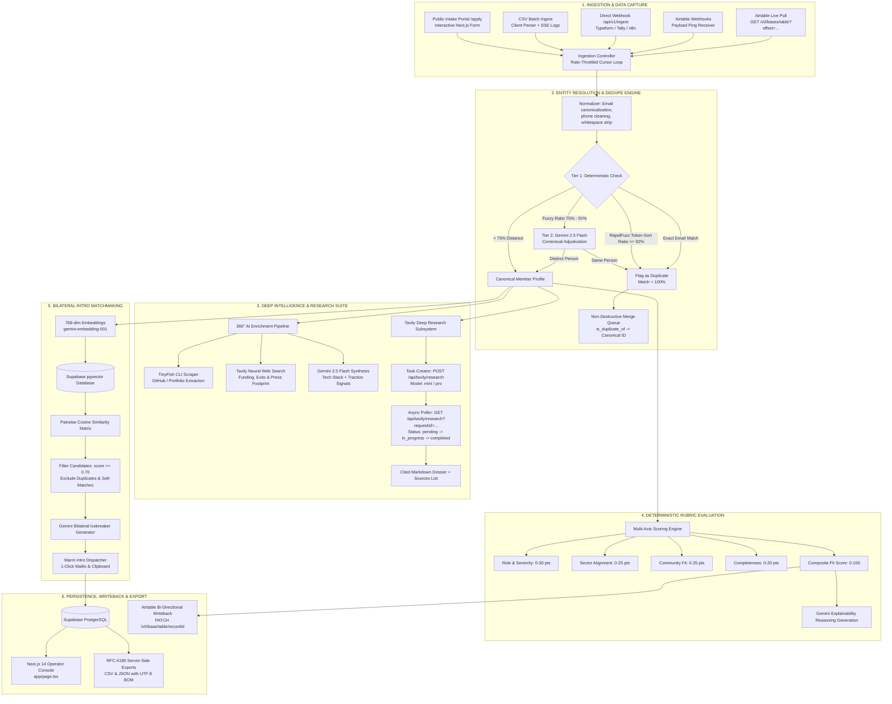

# NetworkOS — System Architecture & Technical Design Rationale

**NetworkOS** is an autonomous relationship intelligence CRM and community operating system. It transforms passive applicant databases into an active, self-enriching network by automating data ingestion, entity deduplication, deep web intelligence, rubric qualification, and bilateral introduction matching.

---

## 1. End-to-End Unified System Architecture

---

## 2. Core Architectural Subsystems

### Subsystem A: Multi-Channel Ingestion & Airtable Web API Suite
1. **Native REST Over Heavy SDKs (`airtable.js`)**:
   * Standard `airtable.js` is built for Node.js callback/promise wrappers with runtime overhead and inflexible pagination.
   * NetworkOS implements direct, lightweight `fetch()` wrappers against `https://api.airtable.com/v0` using modern Next.js Edge/Serverless runtimes.
2. **Dynamic Schema Auto-Discovery**:
   * [`/api/airtable/bases`](file:///u:/offline-os/app/api/airtable/bases/route.ts): Fetches all available bases using the operator's Personal Access Token.
   * [`/api/airtable/tables`](file:///u:/offline-os/app/api/airtable/tables/route.ts): Dynamically inspects table schemas, column names, and field types, enabling zero-config mapping.
3. **Cursor-Based Ingestion (`/api/airtable/sync`)**:
   * Uses Airtable's native `offset` cursor to iterate over paginated records (100 per batch).
   * Enforces 5 requests/sec throttling to respect Airtable API limits.
4. **Official Webhook Lifecycle Management (`/api/airtable/webhooks`)**:
   * Programmatically creates Airtable base webhooks (`POST /v0/bases/{baseId}/webhooks`).
   * Manages 7-day expiration lifecycles (`PATCH .../refresh`).
   * Subscribes to table delta payloads (`GET .../payloads`) and ingests modified records.
5. **Universal Ingest Endpoint (`POST /api/v1/ingest`)**:
   * Open JSON webhook for incoming submissions from Typeform, Tally, Google Forms, and n8n.
   * Executes normalization, deduplication, fit scoring, and sector tagging in real-time.

---

### Subsystem B: Entity Resolution & Hybrid Deduplication
1. **Tier 1 — High-Throughput Deterministic Matching (<1ms)**:
   * Normalizes emails (`user.name+alias@domain.com` -> `username@domain.com`).
   * Runs `RapidFuzz` token-sort string distance on name and company fields.
   * Scores $\ge 92\%$ are flagged immediately as duplicates without LLM invocation.
2. **Tier 2 — Contextual LLM Adjudication (Gemini 2.5 Flash)**:
   * Matches in the ambiguous $75\% - 91\%$ band (e.g. founder re-applying with a new domain or abbreviated company name) are sent to Gemini.
   * Returns a structured decision (`is_duplicate: boolean`, `confidence: float`, `reasoning: string`).
   * This hybrid architecture **saves >85% of LLM token costs** while achieving near-zero false positive rates.
3. **Non-Destructive Canonical Linking**:
   * Duplicate records are not destroyed; they retain their raw data with an `is_duplicate_of` pointer to the canonical record.
   * Operators review candidate pairs side-by-side with an interactive merge verification dialog.

---

### Subsystem C: Deep Intelligence & Autonomous Research (`@tavily/core`)
NetworkOS integrates the complete **Tavily AI Core Suite** as an autonomous intelligence subsystem:
1. **Asynchronous Deep Research Task (`/api/tavily/research`)**:
   * Dispatches long-form research tasks using `client.research(input, { model: 'mini' | 'pro' })`.
   * Returns an immediate `requestId`.
   * Frontend polls `GET /api/tavily/research?requestId=...` until `status === 'completed'`.
   * Outputs an exhaustive Markdown report citing verified primary sources with direct URLs.
2. **Recursive Site Crawler (`/api/tavily/crawl`)**:
   * Recursively traverses target domains with configurable limit (1–50 pages), max depth, and breadth.
   * Extracts clean, structured LLM-ready markdown content.
3. **Multi-URL Clean Extractor (`/api/tavily/extract`)**:
   * Batch extracts markdown content from up to 20 URLs concurrently.
4. **Neural Web Search Engine (`/api/tavily/search`)**:
   * Executes LLM-targeted semantic searches with domain filtering and relevance scores.

---

### Subsystem D: 360° AI Enrichment Fusion Engine
* Located in [`app/api/people/enrich/route.ts`](file:///u:/offline-os/app/api/people/enrich/route.ts).
* **Fusion Logic**:
  * Step 1: Spawns **TinyFish CLI** to scrape the founder's GitHub, personal website, or company domain.
  * Step 2: Queries **Tavily Search** for venture funding rounds, accelerators (Y Combinator, Techstars), and press mentions.
  * Step 3: **Gemini 2.5 Flash** synthesizes raw signals into:
    * Executive Debrief
    * Verified Traction Signals
    * Detected Tech Stack
  * Step 4: Results are stored in local and Supabase cache, displayed in the slide-over details drawer.

---

### Subsystem E: Deterministic Rubric Fit Scoring Engine
* **The Problem with Raw LLM Scoring**: Unconstrained LLM evaluation suffers from score drift, hallucinations, and inability to explain rationale to stakeholders.
* **Deterministic Rubric Architecture**:
  * **Role & Seniority (30 pts)**: C-level / Founder = 30 pts, VP / Director = 25 pts, Senior = 20 pts.
  * **Sector Alignment (25 pts)**: Core focus areas (AI, Climate, Biotech, Deeptech, Fintech) = 25 pts.
  * **Community Fit (25 pts)**: Stated willingness to mentor, host, or collaborate = 25 pts.
  * **Data Completeness (20 pts)**: Presence of Bio, LinkedIn, Website, and Role details = 20 pts.
* **Explainability Layer**: Gemini 2.5 Flash takes the computed numeric score and candidate profile to synthesize a clear, objective 1–2 sentence explanation displayed in interactive tooltips.

---

### Subsystem F: Bilateral Introduction Matchmaking & Dispatcher
1. **Dense Vector Embeddings**:
   * Generates 768-dimensional embeddings using `gemini-embedding-001`.
   * Stored in Supabase `vector(768)` columns with HNSW/IVFFlat indexing.
2. **Cosine Similarity Match Matrix**:
   * Pairwise cosine similarity computes affinity between applicant superpowers and stated needs.
   * Filters out self-matches and flagged duplicates.
3. **AI Icebreaker Synthesis**:
   * Gemini analyzes the shared context between Candidate A and Candidate B.
   * Drafts a natural, personalized double-opt-in intro message.
4. **Warm Intro Dispatcher**:
   * In the operator console, approved intros feature an instant **Dispatch Email** button.
   * Opens pre-populated `mailto:` links with recipient emails, subject, and tailored body, or copies to clipboard for Slack / Superhuman outreach.

---

### Subsystem G: Bi-Directional Synchronizer
* [`/api/airtable/writeback`](file:///u:/offline-os/app/api/airtable/writeback/route.ts):
  * Whenever a candidate is qualified, enriched, or scored in NetworkOS, operators can write back findings to the source Airtable base:
  * `PATCH https://api.airtable.com/v0/{baseId}/{table}/{recordId}`
  * Writes: `Fit Score`, `AI Thesis`, `Sector Tags`, `Synergy Notes`.

---

### Subsystem H: Dual-Workspace Isolation (`Sandbox` vs. `Live`)
* Operators can toggle between:
  * **Sandbox Demo Mode**: Pre-seeded records designed for demonstrations, feature evaluations, and edge-case testing.
  * **Live Production Mode**: Clean environment receiving live external webhooks and Airtable syncs.
* **1-Click Live Workspace Purge (`POST /api/workspace/reset`)**:
  * Safely purges live records without corrupting foreign keys, database schema, or demo datasets.

---

## 3. Technology Selection Matrix

| Layer | Chosen Technology | Rationale & Alternatives Evaluated |
| :--- | :--- | :--- |
| **Framework** | Next.js 14 App Router (TypeScript) | Full-stack unified architecture; serverless API route handlers eliminate dedicated backend microservice dependencies. |
| **Autonomous Intelligence** | `@tavily/core` v0.7+ | Built specifically for agentic workflows with asynchronous deep research, recursive crawling, and clean markdown extraction. Evaluated Google Custom Search (no crawler/extract) and SerpApi (no deep research pipeline). |
| **Airtable Integration** | Native HTTP REST (Zero-SDK) | Modern `fetch()` with scoped PAT avoids `airtable.js` legacy callback bloat and unblocks 7-day webhook lifecycle operations. |
| **Database & Vector Search**| Supabase PostgreSQL + `pgvector` | ACIDs-compliant relational integrity for canonical/duplicate linkages combined with native 768-dim cosine similarity search. |
| **LLM Classification** | Google Gemini 2.5 Flash | High throughput, sub-second latency, and strict schema adherence via structured JSON outputs (`response_schema`). |
| **Entity Deduplication** | `RapidFuzz` + Gemini Hybrid | <1ms local CPU execution catches 90%+ duplicates; LLM only invoked for the 75–91% ambiguous threshold. Saves >85% token costs. |
| **Styling & Design Tokens** | Tailwind CSS + Lucide Icons | High-density operator UI inspired by Linear and macOS enterprise consoles; responsive across desktop and mobile. |

---

## 4. Security, Isolation & Production Hardening

* **Server-Side Secret Isolation**: All sensitive credentials (`SUPABASE_SERVICE_ROLE_KEY`, `TAVILY_API_KEY`, `AIRTABLE_PERSONAL_ACCESS_TOKEN`, `GEMINI_API_KEY`) run strictly inside server route handlers (`app/api/*`). The browser client never touches raw API tokens.
* **RFC-4180 Compliance & UTF-8 BOM**: Server-side exports in `/api/export` enforce RFC 5987/6266 headers and prepend a `\uFEFF` Byte Order Mark, preventing encoding corruption in Microsoft Excel and Apple Numbers.
* **Rate-Limit Resilience**: Ingestion and synchronization loops enforce backoff and retry mechanisms to prevent 429 throttling across external APIs.
* **Reversible Governance**: Duplicate merges are non-destructive and retain full parent record pointers (`is_duplicate_of`).
