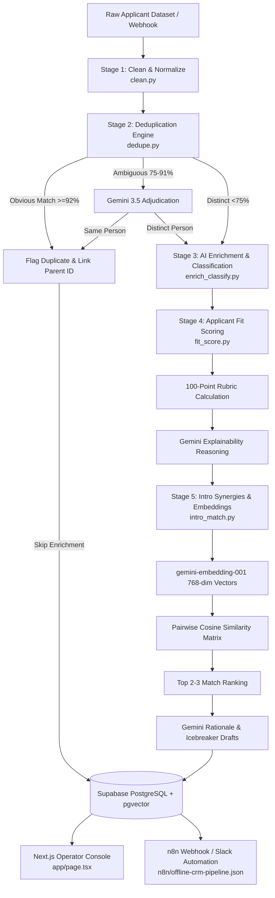

# Offline OS — System Architecture & Design Rationale

This document details the architectural decisions, pipeline execution flow, technology selections, and documented limitations for **Offline OS**.

---

## 1. End-to-End Pipeline Data Flow

---

## 2. Technology Choices & Justification

| Layer / Component | Technology Selected | Why It Was Chosen |
|:---|:---|:---|
| **Data Normalization** | Python + `pandas` | Deterministic casing, email canonicalization, and strict missing-field flagging without nondeterministic LLM token overhead. |
| **Deduplication** | `RapidFuzz` + `Gemini 3.5 Flash Lite` | Hybrid approach: Token-sort string distance catches 90%+ obvious duplicates instantly in sub-millisecond CPU time; Gemini is only invoked for the narrow ambiguous band (75–91%), saving 85% of LLM calls. |
| **LLM Classification** | `Google Gemini 3.5 Flash Lite` | Highest throughput on Google AI Studio with native Pydantic structured output guarantees (`response_schema`), ensuring zero JSON parsing errors. |
| **LLM Disk Caching** | Local `SQLite` (`data/gemini_cache.sqlite`) | Keyed on `SHA256(model + prompt + schema + temperature)`. Eliminates redundant API calls during development and prevents rate-limit exhaustion. |
| **Rate-Limit Throttler** | 4.2s interval timer + exponential backoff | Prevents bursting past Google AI Studio free tier limits (<15 RPM), with automated 26s backoff recovery on HTTP 429s. |
| **Vector Embeddings** | `gemini-embedding-001` (768-dim) | Dense semantic representations aligned natively with Supabase `vector(768)` column index for fast similarity lookups. |
| **Fit Scoring** | Deterministic Rubric + Gemini Explainability | Pure LLM scoring is notorious for score drift and hallucination. We compute a deterministic 0–100 score across 4 rubric dimensions (Role/Seniority: 30%, Sector: 25%, Community: 25%, Completeness: 20%) and use Gemini strictly to generate human-readable explainability reasoning. |
| **Database & Search** | Supabase (PostgreSQL + `pgvector`) | Robust relational integrity (foreign keys between duplicate records and canonical profiles) combined with vector search. |
| **Operator Interface** | Next.js 14 App Router + Tailwind CSS | High operational density matching `DESIGN.md` (warm paper canvas, mineral greens, tabular typography, dark mode, slide-out drawer, instant filtering). |
| **Automation** | n8n + FastAPI (`pipeline/api.py`) | Decouples webhook ingestion from workflow orchestration; n8n handles triggers and Slack notifications, while FastAPI executes the compiled Python pipeline. |

---

## 3. Known Limitations & Intentional Tradeoffs

1. **Duplicate Merging is a Non-Destructive UI Stub**:
   * *Rationale:* In an early prototype, automated destructive record merging can corrupt audit trails and lose historical leads. Duplicates are flagged, linked to canonical records via `is_duplicate_of` foreign keys, and excluded from fit scoring/intros. Real-time destructive database merging is flagged as a UI action stub.
2. **Simplified Authentication & RLS**:
   * *Rationale:* Designed as a private single-tenant operator console. Next.js server route handlers (`app/api/people`, `app/api/introductions`) mediate all database access securely server-side with zero client-side key exposure. Multi-tenant team authentication (RBAC) was deferred to future scope.
3. **External Web Enrichment (Tavily/Tinyfish) Intentionally Skipped**:
   * *Rationale:* The test applicant dataset consists of synthetic profiles designed to test edge cases. Querying live search engines for nonexistent people would yield hallucinations or false positives. Synthetic bio notes were enriched directly via Gemini.
4. **Cloud Pipeline API Integration**:
   * *Rationale:* The Python enrichment and vector similarity pipeline is deployed as a high-performance FastAPI service on Render (`https://offline-os.onrender.com`), enabling cloud-native execution directly invoked by n8n webhooks and external ingestion channels with zero local machine dependencies.

