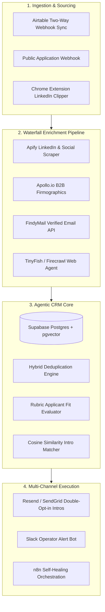

# Offline AI-Native Relationship CRM — Demo Video Script & Production Roadmap

---

## Part 1: Screen-by-Screen Demo Video Script

**Target Duration:** 4–6 Minutes  
**Recommended Recording Setup:** Loom or Screen Studio (1080p / 60fps), Full Screen View  
**Live Production Console:** [https://offline-os-gray.vercel.app/](https://offline-os-gray.vercel.app/)  
**Public Application Portal:** [https://offline-os-gray.vercel.app/apply](https://offline-os-gray.vercel.app/apply)  

---

### Segment 1: The Problem & High-Level Architecture (0:00 – 0:45)

* **Screen to Show:** Browser open at **Offline CRM Dashboard** (`https://offline-os-gray.vercel.app/`).
* **Visual Action:**
  * Hover over top metric cards: *Active Canonical Network (91)*, *Resolved Duplicates (10)*, *Approved Introductions*.
  * Show the dark/light mode toggle in the top right to demonstrate polished UX.
* **What to Say (Narration):**
  > "Hi team Offline! Today, relationships, founders, and applicants live scattered across static Airtable sheets. The moment data enters, it starts decaying: records are incomplete, duplicates pile up, fit evaluation is manual, and valuable cross-founder introductions remain buried.
  > 
  > To solve this, I built **Offline OS** — an end-to-end, AI-native relationship intelligence engine built on Next.js 14, Supabase Postgres, and dual LLM inference pipelines. It autonomously cleans data, deduplicates records, scores applicants against your rubric, and synthesizes mutual introductions between founders and operators. Let's walk through the full live workflow."

---

### Segment 2: Public Application Intake & Real-Time Scoring (0:45 – 1:45)

* **Screen to Show:** Navigate to `https://offline-os-gray.vercel.app/apply`
* **Visual Action:**
  1. Fill the form with a high-caliber applicant profile:
     * **Name:** `Aarav Patel`
     * **Email:** `aarav.patel@novafusion.energy`
     * **Company:** `NovaFusion Systems`
     * **Role:** `Founder & CEO`
     * **Bio:** `Ex-MIT Plasma Science researcher building compact aneutronic fusion reactors for distributed industrial microgrids. Looking for hardware co-founders and growth capital.`
  2. Click **Submit Application & Analyze Fit**.
  3. Wait ~2 seconds for the live LLM pipeline to execute.
  4. Show the animated **Evaluation Result Card** displaying the Fit Score (e.g. `92/100`), AI Reasoning, Sector Tags (`#climate`, `#energy`, `#deep tech`), and instant suggested introductions from the existing database.
* **What to Say (Narration):**
  > "First, we have the live **Public Application Portal**. When a new founder applies, instead of dumping a raw row into a spreadsheet, our real-time AI scoring engine evaluates their background against Offline's community rubric.
  > 
  > Notice that within seconds, Aarav received an **Applicant Fit Score of 92/100**, auto-classified taxonomy, generated sector tags, and the system immediately searched our database to identify complimentary members already in the network. This record is now immediately synced to our live Postgres database."

---

### Segment 3: Operator Console, Filtering & In-Place Lead Editing (1:45 – 2:45)

* **Screen to Show:** Return to the Main CRM Console (`https://offline-os-gray.vercel.app/`) -> **Members Directory** tab.
* **Visual Action:**
  1. In the search bar, type `Aarav` or `Elena` to show instant table filtering.
  2. Filter by Role (*Founders*) and Sector (*Climate & Energy*).
  3. Hover over the **Fit Score Badge** on any row to reveal the rich breakdown tooltip.
  4. Click on any member row (e.g. `Dr. Ananya Ray` or `Aarav Patel`) to open the **Member Details Drawer**.
  5. In the drawer header, highlight the **Export CSV** button and click it to demonstrate instant single-lead export.
  6. Click **Edit**, modify a note or tag (e.g. add `#quantum-computing`), click **Save Changes**, and show the instant database update with toast confirmation.
* **What to Say (Narration):**
  > "Back in the Operator Console, the **Members Directory** provides relationship managers with multi-axis filtering across roles, sector domains, and quality tiers.
  > 
  > Hovering over any fit score displays the exact deterministic rubric breakdown so operators understand *why* someone was scored high or low.
  > 
  > Clicking any row opens our **Member Details Drawer**. Here operators have full in-place CRUD capabilities: we can edit bios, adjust taxonomy, update scores, and export individual lead profiles as clean RFC-4180 CSVs directly from the drawer header."

---

### Segment 4: Intelligent Deduplication & Side-by-Side Merge (2:45 – 3:45)

* **Screen to Show:** Switch to the **Duplicates Queue** tab (`/` -> Duplicates Queue).
* **Visual Action:**
  1. Switch between the filter tabs: **Resolved Merged** and **All History**.
  2. Point out a duplicate pair card (e.g. *Dr. Elena Rostova* or *Marcus Vance* duplicate candidates).
  3. Show the **Side-by-Side Diff Comparison**: Left is the Canonical record, Right is the Duplicate candidate with confidence level (e.g. `100%`) and AI adjudication rationale.
  4. Click the **Export Duplicates CSV** button in the queue header to demonstrate the full audit export.
* **What to Say (Narration):**
  > "The second major bottleneck in Airtable is duplicates. In Offline OS, we implemented a hybrid two-tier deduplication engine. 
  > 
  > Tier 1 executes deterministic normalized fuzzy hashing across email domains, names, and companies. Tier 2 uses LLM reasoning to evaluate ambiguous profile updates — for example, whether someone who changed companies is a duplicate or a new identity.
  > 
  > Operators see a clear side-by-side diff with confidence scores and AI rationale. When an operator confirms a merge, the system consolidates bio notes and preserves full audit provenance in Supabase."

---

### Segment 5: 2-Way Synergistic Introductions Workspace (3:45 – 4:45)

* **Screen to Show:** Switch to the **Introductions Workspace** tab.
* **Visual Action:**
  1. Show the intro cards generated between complimentary members (e.g. Founder building climate tech paired with Operator with energy scaling background).
  2. Highlight the **Match Score** (e.g. `95% - Strong Match`) and the **Shared Context** explanation.
  3. Click **Copy Icebreaker** on an intro card to show the personalized, ready-to-send outreach email draft generated by the AI.
  4. Click **Approve Introduction** to update its status live in the database.
  5. Click **Export Outreach CSV** in the toolbar to show how operators can export approved batches directly into their email outreach sequences.
* **What to Say (Narration):**
  > "The true magic of Offline is human connection. Our **Introductions Engine** doesn't just match keywords — it computes semantic synergies between one person's *needs* and another's *skills*.
  > 
  > For every match, Offline OS generates a contextual synergy rationale and a customized, ready-to-send double-opt-in icebreaker email draft. Operators can approve or dismiss with one click, copy the email draft instantly, or export the entire outreach batch to CSV for email sequencing."

---

### Segment 6: Batch Airtable/CSV Ingestion & Production Exports (4:45 – 5:15)

* **Screen to Show:** Click **Import Airtable Data** in the top bar.
* **Visual Action:**
  1. Click **Load 3 Sample Rows** to populate the preview textarea.
  2. Click **Start Ingestion** to demonstrate the live progress bar and ingestion logs streaming in real-time.
  3. In the main toolbar, click **CSV** and **JSON** to demonstrate the native server streaming exports.
* **What to Say (Narration):**
  > "To migrate existing Offline Airtable bases, we built a built-in batch importer that parses CSV data, runs validation, and ingests records directly into Supabase.
  > 
  > Furthermore, every table supports dedicated server-side export endpoints with UTF-8 BOM encoding for seamless compatibility with Microsoft Excel, Google Sheets, and downstream tools."

---

### Segment 7: Wrap-Up & Vision (5:15 – 5:45)

* **Screen to Show:** Full CRM Console dashboard view.
* **What to Say (Narration):**
  > "Offline OS demonstrates how AI transforms a CRM from a passive, dusty database into an active, intelligent operating system that automates hygiene, evaluates fit, and proactively drives relationship value. Thank you!"

---

## Part 2: Future Production Roadmap (From Open-Source & Enterprise Deep Dives)

Based on architectural patterns analyzed from leading relationship platforms (*Attio, CompAI, CordysCRM, OpenOutreach, Relaticle, YALC*), here is the step-by-step roadmap to scale Offline OS into an enterprise agentic CRM:

### 1. Two-Way Airtable REST & Webhook Bi-Directional Sync
* **How It Works:** Connect Offline's existing Airtable bases via Airtable Webhooks API (`/v0/bases/{baseId}/webhooks`).
* **Feature:** Whenever an Offline team member adds or edits a record in Airtable, a webhook immediately triggers the Supabase ingestion pipeline. Conversely, when Offline OS calculates an AI Fit Score or merges duplicates, it writes back to custom Airtable fields via the Airtable PATCH API.

### 2. Multi-Provider Waterfall Enrichment Pipeline
* **Apollo.io API:** Automatically fetch verified company revenue, headcount, funding rounds, and verified work history.
* **FindyMail API:** Perform real-time MX & SMTP email deliverability validation on incoming applicants to prevent spam or dead emails.
* **Apify LinkedIn Scraper:** Ingest founder career timelines, past exits, and mutual connections without manual data entry.
* **TinyFish / Firecrawl Agentic Research:** For stealth founders with minimal bios, spin up a headless browsing agent to analyze GitHub repos, personal blogs, and news mentions to synthesize a 360-degree founder dossier.

### 3. Vector Embeddings & pgvector Semantic Memory (`text-embedding-3-small`)
* **How It Works:** Generate 1536-dimensional vector embeddings for all member bios, needs, and superpowers using OpenAI or Gemini embeddings.
* **Benefit:** Execute sub-millisecond semantic search (e.g. finding *"someone who scaled hardware supply chains in Southeast Asia"*) using cosine similarity (`<=>`) directly inside Postgres.

### 4. Autonomous n8n Workflow Lifecycle & Orchestration
* **Self-Healing Error Queues:** Implement automated webhook retries and exponential backoff for external API rate limits.
* **Slack Real-Time Notifications:** Post an automated `#offline-vip-alerts` notification whenever an applicant with a **Fit Score > 85** applies, complete with 1-click Slack interactive approve/dismiss buttons.

### 5. Automated Double-Opt-In Intro Email Dispatch
* **Email Engine:** Integrate Resend or Postmark.
* **Feature:** When an operator clicks **Approve Intro**, the platform automatically generates and sends a personalized dual-opt-in email to both founders, tracking acceptance rates and intro feedback loops over time.
