# Offline CRM Prototype PRD

**Status:** Approved for implementation planning

**Role context:** AI Automation Engineer, Founder's Office take-home assignment

**Target build time:** 3-4 focused hours

## 1. Problem Statement

Offline is a private community for founders and senior operators. Its network includes members, founders, operators, and applicants, but the working CRM is maintained manually in Airtable. That creates three related problems:

1. Records are inconsistent. Names, titles, companies, links, and notes arrive in different shapes, with missing fields and repeated people.
2. Useful context is trapped in unstructured notes. It is difficult to classify people, evaluate applicant fit, or retrieve the right relationship context quickly.
3. Introductions depend on memory. The team has no lightweight, explainable way to surface potentially valuable connections.

The prototype should demonstrate a trustworthy path from a messy Airtable-style export to a reviewable, AI-assisted relationship workspace. It is a decision-support tool, not an autonomous CRM operator.

## 2. Goals And Non-Goals

### Goals

- Accept a small Airtable-style CSV export and normalize it into a consistent people dataset.
- Detect incomplete records and surface likely duplicates for human review.
- Use Gemini only where unstructured language understanding adds value: enrichment, classification, applicant rationale, and introduction rationale.
- Produce an applicant-fit score that is explainable rather than a mysterious model output.
- Generate a small set of useful introduction suggestions using Gemini embeddings plus deterministic filters.
- Provide a simple, polished Next.js interface that lets a reviewer scan people, inspect a record, review data-quality flags, and see suggested introductions.
- Provide an importable n8n workflow JSON and setup documentation without connecting to the user's n8n instance.
- Make the demo reproducible, rate-limit aware, and honest about what is AI-generated versus verified source dat

## 3. Data Model Summary

The prototype intentionally keeps the persisted model small: a canonical `people` table and a `introductions` table. Raw provenance and review state live on the people record so the demo can show how a decision was made without introducing a separate job-history system.

### `people`

One canonical record per person after ingestion. A record may represent a member, founder, operator, or applicant.

| Field group | Representative fields | Purpose |
| --- | --- | --- |
| Identity | `id`, `source_record_id`, `full_name`, `first_name`, `last_name` | Stable identity and source traceability |
| Contact | `email`, `email_normalized`, `linkedin_url`, `location`, `timezone` | Search, matching, and relationship context |
| Work | `company`, `title`, `role_type`, `company_stage`, `industries` | Structured filters and applicant-fit inputs |
| Source context | `raw_notes`, `source_payload`, `source_updated_at` | Preserve the original evidence and avoid invented facts |
| Cleaned context | `clean_summary`, `skills`, `needs`, `interests` | Normalized fields used by the interface and matching |
| AI output | `ai_classification`, `ai_enrichment_status`, `ai_model`, `ai_generated_at` | Structured, timestamped AI results with provenance |
| Quality | `missing_fields`, `duplicate_cluster_id`, `duplicate_confidence`, `review_status` | Human review queues and safe deduplication |
| Applicant fit | `fit_score`, `fit_band`, `fit_rationale`, `fit_inputs` | Explainable applicant evaluation |
| Matching | `embedding`, `embedding_model`, `embedding_text` | Semantic similarity for introduction candidates |
| Audit | `created_at`, `updated_at` | Reruns, sorting, and operational visibility |

Implementation notes:

- Use Postgres-native types for scalar fields, `jsonb` for structured AI/provenance payloads, arrays or normalized JSON for small lists, and `pgvector` for the embedding column.
- Normalize email and URL values deterministically before matching. Keep source values available for review.
- `review_status` should distinguish at least `new`, `reviewed`, `needs_review`, and `rejected`.
- AI output must not overwrite source evidence. A reviewer can see the source note next to the derived value.
- Enable RLS on exposed tables. The service-role credential is reserved for the Python pipeline and never used in the browser.

### `introductions`

One proposed connection between two distinct people.

| Field group | Representative fields | Purpose |
| --- | --- | --- |
| Relationship | `id`, `person_a_id`, `person_b_id` | Pair of people; enforce a normalized pair to avoid repeats |
| Recommendation | `match_score`, `match_band`, `shared_context`, `suggested_intro` | Explain why the connection may be useful |
| Evidence | `matched_skills`, `matched_needs`, `matched_interests`, `evidence_snapshot` | Show the inputs behind the suggestion |
| Workflow | `status`, `reviewer_note`, `reviewed_at` | `proposed`, `accepted`, `dismissed`, or `snoozed` |
| Provenance | `generated_by`, `embedding_model`, `generated_at` | Distinguish algorithmic similarity from AI-written language |
| Audit | `created_at`, `updated_at` | Ordering and rerun visibility |

The prototype must never suggest a person to themselves, duplicate the same unordered pair, or create a suggestion without minimum usable profile context.

## 4. Feature Breakdown Mapped To Assignment Requirements

| Assignment requirement | Prototype feature | Definition of done |
| --- | --- | --- |
| 1. Clean and structure data | Python ingest and normalization stage | CSV columns map into the people contract; names, emails, URLs, whitespace, blanks, and obvious type issues are normalized; row counts and changes are reported |
| 2. AI enrich and classify people | Gemini structured enrichment | For records with enough source context, produce bounded JSON for role type, company stage, skills, needs, interests, and a short summary; preserve model, timestamp, and source evidence |
| 3. Detect duplicate and incomplete records | Quality and review queue | Missing-field flags are deterministic; RapidFuzz generates candidate pairs with reason and confidence; no record is silently deleted or merged |
| 4. Build an applicant-fit score | Rubric-backed fit scoring | Applicants receive a 0-100 score or band, weighted input factors, and a concise rationale; score can be recomputed without another LLM call when structured inputs exist |
| 5. Suggest introductions | Embedding retrieval and recommendation generation | Candidate pairs are filtered, ranked by embedding similarity, and stored with shared context and a human-readable suggestion; reviewer can accept or dismiss |
| 6. Build a simple interface/workflow | Next.js dashboard plus n8n importable workflow | Reviewer can inspect people, filter quality/applicant states, open a detail view, review duplicate flags, and inspect intro suggestions; n8n JSON is importable after manual credentials/endpoint setup |

### Core User Flow

1. Reviewer exports a sanitized Airtable-style CSV.
2. Reviewer runs the Python pipeline or triggers it through the imported n8n workflow.
3. The pipeline reports normalization, incomplete fields, duplicate candidates, Gemini usage, and write counts.
4. Reviewer opens the dashboard and filters to needs-review records.
5. Reviewer inspects source evidence and AI-derived fields, then reviews applicant scores and introduction suggestions.
6. Reviewer accepts or dismisses recommendations. No external introduction is sent by the prototype.

## 5. Tech Stack And Why

| Tool | Role | Why it is used |
| --- | --- | --- |
| Supabase Postgres | Storage, SQL, RLS, pgvector | Fast hosted Postgres with a practical API surface, row security, and vector support suitable for a small prototype |
| Python | Pipeline execution | Clear fit for CSV handling, deterministic data quality work, batch orchestration, and explicit rate-limit control |
| pandas | Tabular cleaning and transformation | Makes schema mapping, missing-value analysis, validation, and repeatable transformations concise and inspectable |
| rapidfuzz | Fuzzy duplicate candidate generation | Fast, deterministic similarity for names, emails, companies, and titles; easy to explain to a reviewer |
| Google Gemini API | LLM enrichment, classification, rationale, and embeddings | Strong language understanding with a free Google AI Studio key; use only `gemini-2.5-flash` or `gemini-2.5-flash-lite` for generation and the selected Gemini embedding model for similarity |
| `google-genai` | Python Gemini client | Current Google Gen AI SDK; do not use legacy `google-generativeai` or Vertex-specific paid paths |
| n8n | Importable orchestration layer | Makes the workflow visible and reusable while respecting the constraint that the instance is user-managed and cannot be connected to directly |
| Next.js App Router | Frontend shell and server-side data access | Quick path to a focused React interface with server rendering and clear route boundaries |
| Tailwind CSS | Styling | Fast implementation of the approved `DESIGN.md` tokens without introducing a second design system |

### Gemini Cost And Quota Guardrails

- Use the Google AI Studio API key only. Do not enable billing or call paid APIs.
- Treat `15 RPM` and approximately `1,000 requests/day` as hard operational caps for this assignment, even if current provider limits differ.
- Batch records where the API supports it, sleep between requests, retry `429` responses with bounded exponential backoff, and persist enough progress to resume.
- Prefer deterministic cleaning, dedupe candidate generation, and score arithmetic so the LLM is not called for work it cannot improve.
- Log request counts, successful responses, skipped records, and failures without logging API keys or full private source payloads.

## 6. Pipeline Execution Order And Data Flow

The order is deliberate: deterministic work happens before LLM calls to reduce cost and prevent duplicate or incomplete records from consuming the free-tier budget.

```mermaid
flowchart LR
    A[Sanitized Airtable CSV] --> B[Python ingest and schema map]
    B --> C[Normalize names emails URLs and blanks]
    C --> D[Quality flags and RapidFuzz candidate pairs]
    D --> E[Human-reviewable canonical people set]
    E --> F[Gemini batch enrich and classify]
    F --> G[Deterministic applicant-fit rubric]
    F --> H[Gemini embeddings]
    H --> I[Filtered pair similarity and intro candidates]
    G --> J[Supabase people upsert]
    I --> K[Supabase introductions upsert]
    J --> L[Next.js review dashboard]
    K --> L
    M[n8n schedule or webhook] -. imports and invokes .-> N[Python pipeline entrypoint]
    N --> B
```

### Stage Details

1. **Ingest:** Read a CSV export into a typed DataFrame, map known Airtable headings, preserve unknown columns in `source_payload`, and reject rows with no usable identity.
2. **Normalize:** Trim text, normalize case only for matching keys, standardize URLs, normalize email values, map common role labels, and preserve original values for review.
3. **Quality and dedupe:** Calculate missing-field flags. Use RapidFuzz only to create candidate pairs and confidence scores. Keep high-confidence candidates in a review queue; do not auto-merge.
4. **Enrich and classify:** Send only records with sufficient context to Gemini in bounded batches. Require structured JSON, validate it, and store status plus model/timestamp metadata.
5. **Score applicants:** Apply a visible weighted rubric to structured facts. Gemini can provide classification and rationale, but score arithmetic remains reproducible in Python.
6. **Embed and match:** Build a stable embedding text from verified and clearly labeled derived fields. Generate embeddings within the request budget, filter invalid/self/duplicate pairs, calculate similarity, and keep the top useful suggestions.
7. **Persist:** Upsert people and introductions idempotently. Preserve generated timestamps and source provenance. Emit a run summary with counts and failures.
8. **Review:** Next.js reads reviewable data and exposes accept/dismiss actions. n8n only orchestrates the run; it does not contain secrets or business logic that belongs in Python.

## 7. Success Criteria For A Take-Home Submission

### Functional

- A reviewer can run the pipeline against a sanitized sample export and see a clear run summary.
- Re-running the same input is idempotent: it does not create duplicate people or duplicate unordered introduction pairs.
- Cleaning results are visible, including missing-field counts and examples of normalized values.
- Duplicate candidates include the compared fields, similarity/confidence, and a review state.
- At least one realistic enrichment/classification path uses Gemini structured output, and the UI distinguishes it from source data.
- Applicant fit scores show factor values, weighting or rubric labels, and rationale.
- Introduction suggestions show the two people, similarity/match signal, shared context, and a suggested next step.
- The UI has usable loading, empty, error, success, disabled, and review states and follows `DESIGN.md` in both themes.
- The n8n workflow JSON imports without embedded secrets and has a setup note explaining credentials, trigger, and Python endpoint configuration.

### Judgment And Reliability

- Deterministic transformations are used where they are more reliable and cheaper than AI.
- The system never invents contact details or presents an AI guess as verified fact.
- Free-tier limits are explicit, enforced, and visible in logs or the run summary.
- The demo uses a small, understandable dataset that makes the output easy to inspect in a few minutes.
- The submission note clearly states what was built, the architecture, where AI helped, known limitations, and what another week would improve.

### Submission Evidence

The final handoff should include:

- A short README or submission note with the four required reflections.
- A repeatable local pipeline command and environment setup steps.
- A screenshot or short walkthrough of the dashboard review flow.
- A sample input and representative output or run summary.
- The importable n8n workflow JSON and its manual setup instructions.
- A short limitations section that names free-tier constraints, human review boundaries, and prototype-only security assumptions.

## 8. Time Budget

Target: **225 minutes (3 hours 45 minutes)**. Stop polishing once the end-to-end demo path is reliable.

| Phase | Time | Output |
| --- | ---: | --- |
| 0. Environment and contract | 15 min | `.env`, sample input shape, run command, key boundaries |
| 1. Supabase schema and RLS | 25 min | `people` and `introductions` tables, indexes/constraints, reviewed policies |
| 2. Ingest, clean, and dedupe | 35 min | Validated pandas transforms, quality flags, RapidFuzz candidates |
| 3. Gemini enrichment and classification | 40 min | Structured output, batching, sleeps, retries, usage logging |
| 4. Fit score, embeddings, and intro suggestions | 25 min | Explainable score, vector similarity, persisted recommendations |
| 5. Next.js review interface | 35 min | Dashboard, people/detail views, quality and intro review states |
| 6. n8n workflow JSON and setup doc | 20 min | Importable orchestration workflow with no embedded secrets |
| 7. Verification, demo path, and submission note | 30 min | Smoke checks, screenshots/walkthrough, limitations, next-week plan |

## Product Decisions To Preserve During Build

- Human review is the control point for duplicates and introductions.
- Source evidence remains visible beside AI-derived fields.
- The free Gemini quota is a product constraint, not an implementation detail.
- The interface should make useful work obvious in the first viewport: what needs review, who is a promising applicant, and which introductions are worth considering.
- Scope ends at decision support and an importable workflow. Sending or syncing is a future iteration.
