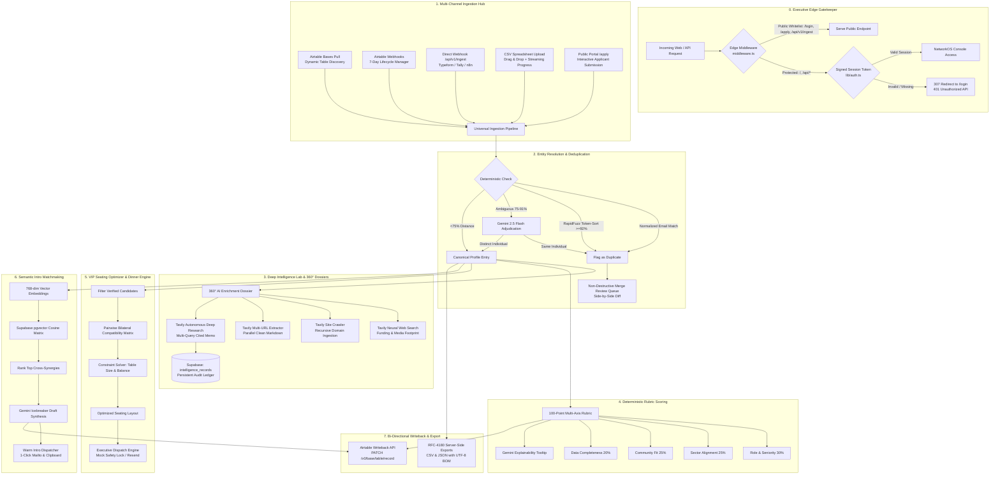

# NetworkOS — Autonomous AI-Native Community Intelligence & Operator CRM

<p align="center">
  
  
  
  
  
  
  
</p>

**NetworkOS** (evolved from *Offline OS*) is an enterprise-grade, autonomous relationship intelligence engine and operator console built for elite tech networks, founder communities, venture studios, and high-trust private ecosystems.

It replaces static spreadsheets, manual candidate evaluation, and disconnected tools with an **active, autonomous operating system**:
* **Multi-Source Ingestion**: Ingests applicants from **Airtable**, **Typeform**, **n8n**, CSV spreadsheets, and a public applicant intake portal.
* **Executive Edge Security**: Protected by Next.js Edge Middleware and signed HMAC-SHA256 session tokens with zero public data leaks.
* **Sub-Millisecond Entity Resolution**: Adjudicates fuzzy duplicates with local **RapidFuzz token-sort** and contextual **Gemini 2.5 Flash** resolution.
* **Deep Intelligence Lab**: Conducts autonomous multi-step market research, recursive web crawling, parallel URL extraction, and neural search.
* **Deterministic 100-Point Rubric**: Evaluates applicant fit objectively across 4 dimensions with explainable LLM reasoning.
* **VIP Seating Optimizer**: Calculates bilateral compatibility scores and generates optimized dinner table arrangements with executive dispatch.
* **768-Dimensional Semantic Matchmaking**: Discovers cross-synergies using **Supabase `pgvector`** and synthesizes personalized double-opt-in icebreakers.
* **Bi-Directional Airtable Sync**: Automatically writes AI scores, evaluation theses, and tags back to Airtable bases in real-time.
* **Executive Output Rendering**: Features responsive visual telemetry bar charts, financial/GTM comparison tables, and dark terminal architecture flowcharts.

---

## 🌐 Live Production Deployments & Links

| Component | Platform | Status | URL | Description |
| :--- | :--- | :--- | :--- | :--- |
| **Operator Console** | **Vercel** | 🟢 Live 24/7 | **[https://offline-os-gray.vercel.app](https://offline-os-gray.vercel.app)** | Executive dashboard (Members, Duplicates, Intros, Seating, Intelligence Lab) |
| **Executive Sign In** | **Vercel** | 🟢 Live 24/7 | **[https://offline-os-gray.vercel.app/login](https://offline-os-gray.vercel.app/login)** | Protected edge-authenticated access portal |
| **Public Applicant Portal** | **Vercel** | 🟢 Live 24/7 | **[https://offline-os-gray.vercel.app/apply](https://offline-os-gray.vercel.app/apply)** | Whitelisted public applicant intake form |
| **GitHub Repository** | **GitHub** | 🟢 Public | **[https://github.com/bhaktofmahakal/offline-os](https://github.com/bhaktofmahakal/offline-os)** | Full source code with automated CI/CD deployment |

---

## 🔄 Complete End-to-End System Architecture



---

## 🚀 Key Feature Modules

### 1. Executive Edge Security & Authentication
* **Edge Middleware Interception (`middleware.ts`)**: Every request to the operator console or internal API is intercepted at the Vercel edge before running application code.
* **Tamper-Proof Session Cryptography (`lib/auth.ts`)**: Uses Web Crypto API to sign and verify HMAC-SHA256 tokens stored in `HttpOnly`, `SameSite=Lax`, `Secure` cookies valid for 30 days.
* **Granular Route Protection**:
  * **Protected**: `/` (Operator Console), `/api/people/*`, `/api/introductions/*`, `/api/seating/*`, `/api/tavily/*`, `/api/airtable/*`.
  * **Public**: `/login`, `/apply` (Candidate application portal), `/api/v1/ingest` (Webhook ingestion).
* **Master Operator Credentials**: Strict authentication preventing unauthorized data inspection.
* **Zero Input Leaks**: Input fields start completely empty with clean placeholders, eliminating browser credential caching bugs.

### 2. Ingestion Hub & Native Airtable Web API Suite
* **Zero-SDK REST Architecture**: Direct HTTPS calls to `https://api.airtable.com/v0` using Personal Access Tokens, eliminating heavyweight legacy SDK dependencies.
* **Dynamic Base & Table Auto-Discovery**: Automatically enumerates accessible bases and fetches table schemas via `/api/airtable/bases` and `/api/airtable/tables`.
* **Full Webhooks Lifecycle Manager**: Programmatically creates (`POST`), lists (`GET`), refreshes (`PATCH` for 7-day expiration extension), and deletes (`DELETE`) official Airtable webhooks.
* **Universal Real-Time Ingest (`POST /api/v1/ingest`)**: Zero-latency endpoint with rapid deduplication and auto-tagging for Typeform, Tally, Airtable Automations, and n8n.
* **Bi-Directional Writeback (`POST /api/airtable/writeback`)**: Synchronizes AI Fit Scores, reasoning theses, and sector tags directly back into Airtable bases.

### 3. Deep Intelligence Lab & Persistent Audit Ledger
Accessible directly from the operator dashboard navigation:
1. **Autonomous Deep Research**: Multi-step research tasks that autonomously formulate search plans, gather cited sources, and synthesize comprehensive executive memos.
2. **Recursive Site Crawler**: Traverses target domains up to 50 pages deep, extracting structured markdown for knowledge discovery.
3. **Multi-URL Clean Extractor**: Extracts sanitized markdown from up to 20 URLs simultaneously in parallel.
4. **Neural Web Search Engine**: Real-time semantic web queries with domain filtering and relevance percentage scoring.
5. **Persistent Audit Ledger (`public.intelligence_records`)**: All research memos, scrape extracts, and crawl trees are stored permanently in Supabase PostgreSQL. Operators can restore historical runs in 1-click with **zero LLM token re-run cost**.

### 4. Advanced Output Rendering Engine
* **Visual Telemetry Horizontal Bar Visualizers**:
  * Automatically detects bracket telemetry data (`[====] 85%` or `[████] 92%`).
  * Renders filled, responsive forest green bars (`#557A5D`) with real-time percentage indicators.
  * Features an interactive toggle between **Visual Bars** and **Raw ASCII** output.
* **Executive Tabular Parser (`ExecutiveMarkdownViewer`)**:
  * Preserves markdown tables completely intact.
  * Formats financial, GTM, and quantitative comparison tables with crisp headers, alternating rows, and performance delta styling.
* **High-Contrast Dark Terminal Flowcharts**:
  * Detects ASCII diagrams (`┌`, `┐`, `└`, `┘`, `│`, `─`, `+---`, `-->`).
  * Renders them inside an executive terminal container (`#141614` background, `#E0E2DC` monospace text, emerald status badge, and 1-click copy code button).
* **Scraped Content Sanitization**:
  * Automatically repairs multi-line markdown links produced by web scrapers.
  * Strips orphaned brackets (`[### Heading]`, `[Article - 3 min read`, `• [`, isolated `[`).
  * Balances markdown bold tags to eliminate leaking asterisks (`**`).

### 5. Entity Resolution & Deduplication Queue
* **Hybrid RapidFuzz + LLM Architecture**:
  * **Tier 1**: Deterministic email normalization and token-sort fuzzy matching calculated in <1ms locally on the CPU.
  * **Tier 2**: Gemini 2.5 Flash contextually resolves edge cases (e.g. founder applying under personal email or updated corporate entity).
* **Side-by-Side Diff Viewer**: Canonical record vs. duplicate candidate side-by-side comparison with match confidence scores.
* **Non-Destructive Merge Engine**: Consolidates profile notes, maintains complete audit history in `is_duplicate_of`, and automatically excludes duplicate profiles from matchmaking pools.

### 6. Deterministic Rubric Fit Scoring
* **Objective 100-Point Rubric**: Eliminates subjective LLM drift by scoring across 4 fixed dimensions:
  * Role & Seniority (30 pts)
  * Sector Alignment (25 pts)
  * Community Fit (25 pts)
  * Profile Completeness (20 pts)
* **Explainable Reasoning**: Gemini generates concise 1–2 sentence human-readable rationales displayed on hover in interactive tooltips.

### 7. VIP Seating Optimizer & Dinner Compatibility Engine
* **Bilateral Compatibility Matrix**: Calculates pairwise synergy scores based on shared sectors, complementary founder skills, and networking objectives.
* **Constraint Solver**: Optimizes table allocations (e.g. 6–10 guests per table) balancing seniority, investor-to-founder ratios, and mutual interests.
* **Executive Dispatch System (`/api/seating/dispatch`)**:
  * Dispatches custom dinner invitations and seat assignments.
  * **Mock Email Safety Lock**: Test-mode intercepts dispatches to developer-safe mock emails, preventing accidental emails to real network members.

### 8. Bilateral Matchmaking & Warm Intro Dispatcher
* **Semantic Vector Embeddings**: Generates 768-dimensional dense vectors using Google AI.
* **Supabase `pgvector` Cosine Similarity**: Fast pairwise matrix calculation against existing network members.
* **Personalized Intro Drafts**: Automatically synthesizes mutual synergies and generates natural, ready-to-send double-opt-in icebreakers.
* **Warm Intro Dispatcher**: Opens pre-formatted `mailto:` client or copies structured intros with 1 click.

### 9. Dual-Workspace Architecture & Live Purge
* **Sandbox Demo Mode**: Pre-loaded with seed records for demonstration, walkthroughs, and UI testing.
* **Live Production Mode**: Clean workspace for real Airtable imports, webhook payloads, and live portal applicants.
* **1-Click Live Workspace Purge**: Securely clears live records and introductions without touching the database schema or demo data.

---

## 🛠️ Complete Repository Structure

```
offline-os/
├── app/                              # Next.js 14 App Router
│   ├── api/                          # Serverless Edge & Node API Routes
│   │   ├── airtable/                 # Native Airtable Web API Suite
│   │   │   ├── bases/                # GET: List bases in Airtable workspace
│   │   │   ├── sync/                 # POST: Cursor-paginated pull sync
│   │   │   ├── tables/               # GET: Dynamic schema & table definitions
│   │   │   ├── webhook-receiver/     # POST: Event listener for Airtable notifications
│   │   │   ├── webhooks/             # GET, POST, PATCH (7-day refresh), DELETE
│   │   │   └── writeback/            # POST: Bi-directional PATCH sync of AI score & tags
│   │   ├── auth/                     # Executive Authentication Endpoints
│   │   │   ├── login/                # POST: Authenticate & issue signed session cookie
│   │   │   ├── logout/               # POST: Clear session cookie
│   │   │   └── session/              # GET: Validate current executive session
│   │   ├── cron/                     # Scheduled Cron Tasks
│   │   │   └── keepalive/            # GET: Database & service keepalive ping
│   │   ├── export/                   # GET: RFC-4180 CSV & JSON export engine
│   │   ├── intelligence/             # GET, POST, DELETE: Persistent Intelligence Audit Ledger
│   │   ├── introductions/            # GET, POST: Intro approval, dismissal, and retrieval
│   │   ├── people/                   # CRUD & 360° AI enrichment
│   │   │   ├── enrich/               # POST: Trigger real-time web & neural enrichment
│   │   │   └── merge/                # POST: Non-destructive profile merge
│   │   ├── seating/                  # VIP Seating Optimizer & Dispatch
│   │   │   ├── dispatch/             # POST: Executive email dispatch (with safety lock)
│   │   │   └── optimize/             # POST: Bilateral table compatibility optimizer
│   │   ├── slack/                    # Slack Integrations
│   │   │   └── actions/              # POST: Interactive Slack notification receiver
│   │   ├── tavily/                   # Tavily AI Intelligence Suite
│   │   │   ├── crawl/                # POST: Recursive domain crawler
│   │   │   ├── extract/              # POST: Multi-URL parallel content extractor
│   │   │   ├── map/                  # POST: Domain URL hierarchy mapper
│   │   │   ├── research/             # POST: Autonomous deep research initiator & poller
│   │   │   └── search/               # POST: Neural web search engine
│   │   ├── v1/ingest/                # POST: Universal webhook receiver (Typeform/Tally/n8n)
│   │   └── workspace/reset/          # POST: Dual-workspace live purge engine
│   ├── apply/                        # Public applicant intake portal
│   │   └── page.tsx                  # Interactive multi-step application form
│   ├── login/                        # Executive Authentication Portal
│   │   └── page.tsx                  # Ivory/cream editorial sign-in page
│   ├── globals.css                   # Tailwind tokens, typography, and custom variables
│   ├── layout.tsx                    # Root HTML wrapper & fonts (Inter + Newsreader)
│   ├── page.tsx                      # Main Operator Console (Dashboard, Intel Lab, Seating)
│   └── icon.svg                      # NetworkOS brand icon
├── lib/                              # Shared Core Libraries
│   ├── auth.ts                       # Web Crypto HMAC-SHA256 session management
│   ├── supabase.ts                   # Supabase PostgreSQL & pgvector client
│   └── tavily.ts                     # Tavily client singleton
├── middleware.ts                     # Next.js Edge Middleware for global route protection
├── n8n/                              # n8n Automated Workflows
│   └── offline-crm-pipeline.json     # Importable webhook-to-Slack workflow
├── scripts/                          # Diagnostic & Verification Scripts
│   ├── inspect_records.mjs           # Live Supabase audit tool
│   ├── test_render_audit.mjs         # Visual renderer verification suite
│   └── seed.mjs                      # Demo workspace data seeder
├── supabase/                         # Database Definitions
│   └── schema.sql                    # PostgreSQL schema, pgvector indexes, and RLS
├── ARCHITECTURE.md                   # In-depth system architecture & design rationale
├── SUBMISSION_NOTE.md                # Comprehensive product note & engineering evaluation
└── README.md                         # Platform documentation & setup guide
```

---

## ⚡ Quickstart Guide

### 1. Prerequisites
* **Node.js** v18.0.0 or higher
* **npm** v9.0.0 or higher
* **Supabase Project** (PostgreSQL with `pgvector` extension enabled)
* **Google Gemini API Key** (`AIza...`)
* **Tavily API Key** (`tvly-...`)
* **Airtable Personal Access Token** (`pat...`)

### 2. Environment Configuration

Clone the repository and copy the example environment file:
```bash
git clone https://github.com/bhaktofmahakal/offline-os.git
cd offline-os
cp .env.example .env
```

Configure the following variables in `.env`:
```ini
# ==============================================================================
# Database (Supabase PostgreSQL + pgvector)
# ==============================================================================
SUPABASE_URL=https://<your-project-ref>.supabase.co
SUPABASE_SERVICE_ROLE_KEY=eyJhbGciOi...

# ==============================================================================
# Artificial Intelligence Models
# ==============================================================================
# Google Gemini (Deduplication adjudication, Fit scoring, Icebreaker drafts)
GEMINI_API_KEY=AIzaSy...

# Tavily AI (Deep research, site crawling, clean extraction, neural search)
TAVILY_API_KEY=tvly-...

# ==============================================================================
# Native Airtable Web API
# ==============================================================================
AIRTABLE_PERSONAL_ACCESS_TOKEN=pat...
AIRTABLE_BASE_ID=app...
AIRTABLE_TABLE_NAME=Applications

# ==============================================================================
# Executive Authentication & Security
# ==============================================================================
ADMIN_EMAIL=utsavmishraa005@gmail.com
ADMIN_PASSWORD_HASH=c35965eb45e69e2cfa76e4ddfcb3df... # SHA-256 hash of password
JWT_SECRET=your-secure-random-jwt-secret-key-32-chars-min

# ==============================================================================
# Email & Dispatch (Optional - for Seating / Intros)
# ==============================================================================
RESEND_API_KEY=re_...
NEXT_PUBLIC_APP_URL=https://offline-os-gray.vercel.app
```

### 3. Database Migration

Run the SQL migration script in your Supabase SQL Editor:
```bash
# Found at: supabase/schema.sql
```
This sets up:
* `public.people` table with 768-dimensional `vector` embedding column.
* `public.introductions` table for bilateral matchmaking.
* `public.intelligence_records` table for the persistent Deep Intelligence Audit Ledger.
* Vector cosine similarity match indexes.

### 4. Install & Run Locally

```bash
# Install dependencies
npm install

# Run type check and production build
npm run build

# Start local development server (Port 3000)
npm run dev
```

Open `http://localhost:3000` in your browser.

---

## 📡 Core API Reference

| Method | Endpoint | Protection | Description |
| :--- | :--- | :--- | :--- |
| `POST` | `/api/auth/login` | Public | Authenticates credentials and sets 30-day session cookie |
| `POST` | `/api/auth/logout` | Public | Invalidates and removes the session cookie |
| `GET` | `/api/auth/session` | Public | Checks current session validity |
| `POST` | `/api/v1/ingest` | Public | Universal webhook endpoint for Typeform, Tally, and n8n |
| `GET` | `/api/people` | Protected | Fetches canonical member directory with filters |
| `POST` | `/api/people/enrich` | Protected | Runs 360° AI research on a member |
| `POST` | `/api/people/merge` | Protected | Performs non-destructive profile merge |
| `GET` | `/api/introductions` | Protected | Retrieves pending and approved warm intro pairs |
| `POST` | `/api/seating/optimize` | Protected | Runs bilateral compatibility seating algorithm |
| `POST` | `/api/seating/dispatch` | Protected | Dispatches dinner invitations (mock safety locked) |
| `POST` | `/api/tavily/research` | Protected | Dispatches and polls autonomous deep research tasks |
| `POST` | `/api/tavily/crawl` | Protected | Recursively crawls target domain |
| `POST` | `/api/tavily/extract` | Protected | Extracts clean markdown from multiple URLs |
| `POST` | `/api/tavily/search` | Protected | Executes neural web search |
| `GET` | `/api/intelligence` | Protected | Fetches persistent historical intelligence records |
| `POST` | `/api/airtable/sync` | Protected | Ingests records via cursor-paginated Airtable pull |
| `POST` | `/api/airtable/writeback`| Protected | Syncs AI Fit scores and tags back to Airtable |
| `GET` | `/api/export?format=csv` | Protected | Downloads RFC-4180 CSV with UTF-8 BOM |

---

## 🔒 Security & Privacy Guarantees

1. **Zero Client-Side Secret Exposure**: All API keys (`SUPABASE_SERVICE_ROLE_KEY`, `GEMINI_API_KEY`, `TAVILY_API_KEY`, `AIRTABLE_PERSONAL_ACCESS_TOKEN`, `JWT_SECRET`) execute strictly server-side.
2. **Edge Authentication Interception**: Next.js Edge Middleware prevents unauthorized access to all operator views and private endpoints.
3. **Mock Email Dispatch Lock**: Seating and intro dispatch engines default to developer mock email trapping to guarantee no unverified outbound emails are sent.
4. **Non-Destructive Data Lineage**: Merged duplicate records and dismissed matches retain full historical provenance in PostgreSQL.

---

## 📄 License

MIT License © 2026 NetworkOS Contributors.
