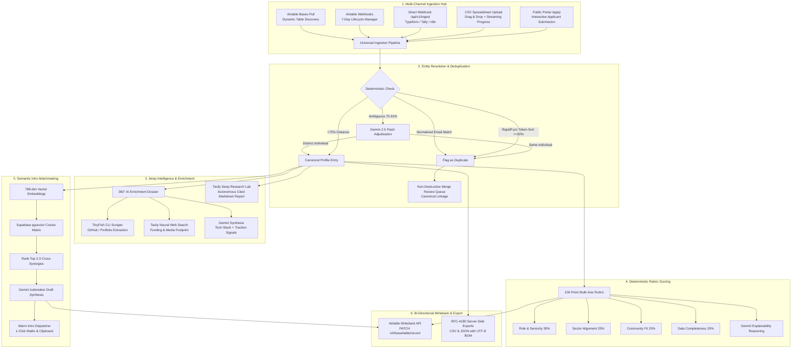

# NetworkOS — Autonomous AI-Native Community Intelligence & Operator CRM

<p align="center">
  
  
  
  
  
  
</p>

**NetworkOS** (evolved from *Offline OS*) is an enterprise-grade, autonomous relationship intelligence engine and operator console built for elite tech networks, founder communities, venture studios, and modern operator networks.

It replaces static spreadsheets and manual reviews with an **active, autonomous operating system**:
* Ingests applicants from **Airtable**, **Typeform**, **Tally**, **n8n**, CSV spreadsheets, and a public portal.
* Adjudicates fuzzy duplicates in <1ms with **RapidFuzz + Gemini 2.5 Flash**.
* Performs deep autonomous market research and web crawls using the **Tavily AI Core Suite** (`@tavily/core`).
* Generates 360° founder dossiers using **TinyFish CLI** and real-time neural search.
* Evaluates applicant fit deterministically via an explainable 100-point rubric.
* Identifies bilateral introductions using **768-dimensional semantic embeddings** (`pgvector`), drafting customized double-opt-in icebreakers.
* Writes evaluation intelligence back to Airtable bi-directionally in real-time.

---

## 🌐 Live Production Deployments & Links

| Component | Platform | Status | URL |
| :--- | :--- | :--- | :--- |
| **Operator Console (Dashboard)** | **Vercel** | 🟢 Live 24/7 | **[https://offline-os-gray.vercel.app](https://offline-os-gray.vercel.app)** |
| **Public Application Portal** | **Vercel** | 🟢 Live 24/7 | **[https://offline-os-gray.vercel.app/apply](https://offline-os-gray.vercel.app/apply)** |
| **Airtable Universal Ingest API** | **Vercel Serverless** | 🟢 Live 24/7 | `POST /api/v1/ingest` |
| **Tavily Intelligence API Suite** | **Vercel Serverless** | 🟢 Live 24/7 | `POST /api/tavily/*` |
| **Python Auxiliary Microservice** | **Render** | 🟡 Active | **[https://offline-os.onrender.com](https://offline-os.onrender.com)** |
| **GitHub Repository** | **GitHub** | 🟢 Public | **[https://github.com/bhaktofmahakal/offline-os](https://github.com/bhaktofmahakal/offline-os)** |

> [!NOTE]
> **Production Infrastructure:** The core CRM, Ingestion Hub, Deep Intelligence Lab, Member CRUD, AI Scoring, and Database operations run serverless 24/7 on **Vercel + Supabase Cloud PostgreSQL**. All secrets run securely server-side with zero client-side leakage.

---

## 🔄 Complete End-to-End Product Flow



---

## 🚀 Key Feature Modules

### 1. Ingestion Hub & Airtable Web API Suite
* **Native REST Architecture (Zero-SDK)**: Directly interfaces with `https://api.airtable.com/v0` using scoped Personal Access Tokens, eliminating legacy SDK bloat.
* **Schema & Table Auto-Discovery**: Dynamically queries bases and tables via `/api/airtable/bases` and `/api/airtable/tables`.
* **Airtable Webhooks Lifecycle Engine**: Full programmatic control over official Airtable webhooks (`GET`, `POST`, `PATCH` for 7-day expiration extension, and `DELETE`).
* **Universal Real-Time Ingest (`POST /api/v1/ingest`)**: Zero-latency endpoint with rapid deduplication and auto-tagging for Tally, Typeform, Airtable Automations, and n8n.
* **Bi-Directional Writeback (`POST /api/airtable/writeback`)**: Automatically syncs AI Fit Score, thesis, and sector tags back into custom Airtable columns.

### 2. Deep Intelligence Lab (Powered by `@tavily/core`)
A dedicated intelligence workspace accessible directly from the dashboard navigation:
1. **🔬 Autonomous Deep Research**:
   * Multi-query planning and synthesis (`mini` fast vs. `pro` exhaustive models).
   * Asynchronous task dispatch and polling (`/api/tavily/research`).
   * Renders comprehensive Markdown intelligence reports with clickable, verified primary sources.
2. **🕷️ Recursive Site Crawler & Mapper**:
   * Recursively crawls target domains up to 50 pages with configurable depth and breadth.
   * Delivers clean, structured, LLM-ready markdown extracts (`/api/tavily/crawl`).
3. **📄 Multi-URL Clean Extractor**:
   * Batch extracts markdown content from up to 20 URLs in parallel (`/api/tavily/extract`).
4. **⚡ Neural Web Search Engine**:
   * Real-time semantic web queries with domain filtering and relevance percentage scoring (`/api/tavily/search`).
5. **Slide-Over Drawer 1-Click Research Memo**:
   * Generates instant executive background briefs on any member's ventures, investments, and footprint.

### 3. Entity Resolution & Deduplication Queue
* **Hybrid RapidFuzz + LLM Matching**:
  * Tier 1: Normalized email and token-sort fuzzy string distance calculated in <1ms locally on the CPU.
  * Tier 2: Gemini 2.5 Flash contextually resolves edge cases (e.g. founder applying under personal email or updated corporate entity).
* **Side-by-Side Diff Viewer**: Canonical record vs. duplicate candidate side-by-side comparison with match confidence scores.
* **Non-Destructive Merge Engine**: Consolidates profile notes, maintains complete audit history in `is_duplicate_of`, and automatically excludes duplicate profiles from matchmaking pools.

### 4. Deterministic Rubric Fit Scoring
* **Objective 100-Point Rubric**: Eliminates subjective LLM drift by scoring across 4 fixed dimensions:
  * Role & Seniority (30 pts)
  * Sector Alignment (25 pts)
  * Community Values & Mission (25 pts)
  * Profile Completeness (20 pts)
* **Explainable Reasoning**: Gemini generates concise 1–2 sentence human-readable rationales displayed on hover in interactive tooltips.

### 5. Bilateral Matchmaking & Warm Intro Dispatcher
* **Semantic Embeddings**: Generates 768-dimensional dense vectors using Google AI.
* **Vector Cosine Similarity**: Fast pairwise matrix calculation against existing network members in Supabase `pgvector`.
* **Personalized Intro Drafts**: Automatically synthesizes mutual synergies and generates natural, ready-to-send double-opt-in icebreakers.
* **Warm Intro Dispatcher**: Opens pre-formatted `mailto:` client or copies structured intros with 1 click.

### 6. Dual-Workspace Architecture & Live Purge
* **Sandbox Demo Mode**: Pre-loaded with seed records for demonstration, walkthroughs, and UI testing.
* **Live Production Mode**: Clean workspace for real Airtable imports, webhook payloads, and live portal applicants.
* **1-Click Live Workspace Purge**: Securely clears live records and introductions without touching the database schema or demo data.

---

## ⚡ Quickstart Guide

### 1. Prerequisites
* **Node.js** v18+ and **npm** v9+
* **Supabase Project** (PostgreSQL with `pgvector` enabled)
* **Google Gemini API Key** (`AIza...`)
* **Tavily API Key** (`tvly-...`)
* **Airtable Personal Access Token** (`pat...`)

### 2. Environment Setup

Clone the repository and copy the environment file:
```bash
git clone https://github.com/bhaktofmahakal/offline-os.git
cd offline-os
cp .env.example .env
```

Configure your `.env`:
```ini
# Supabase Configuration
SUPABASE_URL=https://<your-project-ref>.supabase.co
SUPABASE_SERVICE_ROLE_KEY=eyJhbGciOi...

# Google Gemini AI Key
GEMINI_API_KEY=AIzaSy...

# Tavily AI Core Suite Key
TAVILY_API_KEY=tvly-...

# Airtable Personal Access Token (PAT)
AIRTABLE_PERSONAL_ACCESS_TOKEN=pat...
```

### 3. Install & Build

```bash
# Install dependencies
npm install

# Run type check and production build
npm run build

# Start development server (Port 3000)
npm run dev
```

Visit `http://localhost:3000` in your browser.

---

## 🛠️ Repository Structure

```
offline-os/
├── app/                        # Next.js 14 App Router
│   ├── api/
│   │   ├── airtable/           # Native Airtable Web API Suite
│   │   │   ├── bases/          # Discovery: List workspaces & bases
│   │   │   ├── sync/           # Ingestion: Cursor pagination pull sync
│   │   │   ├── tables/         # Discovery: Dynamic schema & table definitions
│   │   │   ├── webhook-receiver/# Event listener for Airtable notifications
│   │   │   ├── webhooks/       # Full webhook lifecycle manager (CRUD + 7d refresh)
│   │   │   └── writeback/      # Bi-directional PATCH sync of AI score & tags
│   │   ├── tavily/             # Complete Tavily AI Core Suite
│   │   │   ├── crawl/          # Recursive domain crawler & markdown extractor
│   │   │   ├── extract/        # Multi-URL parallel content extractor
│   │   │   ├── map/            # Structural URL hierarchy mapper
│   │   │   ├── research/       # Autonomous research task initiator & polling
│   │   │   └── search/         # Neural web search engine
│   │   ├── export/             # RFC-4180 CSV & JSON export engine with UTF-8 BOM
│   │   ├── introductions/      # Intro approval, dismissal, and retrieval
│   │   ├── people/             # Member CRUD & 360° AI enrichment
│   │   ├── v1/ingest/          # Universal webhook receiver (Typeform/Tally/n8n)
│   │   └── workspace/reset/    # Dual-workspace live purge engine
│   ├── apply/                  # Public applicant intake portal
│   ├── globals.css             # Design tokens & dark mode utilities
│   ├── layout.tsx              # Root HTML wrapper & fonts
│   └── page.tsx                # Operator Console (Members, Duplicates, Intros, Intelligence Lab)
├── lib/
│   ├── tavily.ts               # Singleton Tavily client wrapper
│   └── supabase.ts             # Supabase PostgreSQL client
├── n8n/                        # n8n Automated Workflows
│   └── offline-crm-pipeline.json # Importable webhook-to-Slack workflow
├── pipeline/                   # Python AI pipeline (FastAPI / auxiliary)
├── supabase/
│   └── schema.sql              # Database DDL with pgvector indexes
├── ARCHITECTURE.md             # In-depth system architecture & design rationale
├── SUBMISSION_NOTE.md          # Comprehensive product note & engineering evaluation
└── README.md                   # System documentation & quickstart
```

---

## 🔒 Security & Privacy Architecture

* **Zero Client-Side Secret Leakage**: `SUPABASE_SERVICE_ROLE_KEY`, `TAVILY_API_KEY`, `AIRTABLE_PERSONAL_ACCESS_TOKEN`, and `GEMINI_API_KEY` are strictly server-side. The client browser never interacts with raw API keys.
* **Untracked Environment Files**: `.env` is enforced in `.gitignore` and excluded from source control.
* **Audit Provenance**: Duplicate mergers and dismissal actions preserve full source provenance and record links for compliance and reversible governance.

---

## 📄 License

MIT License © 2026 NetworkOS Contributors.
